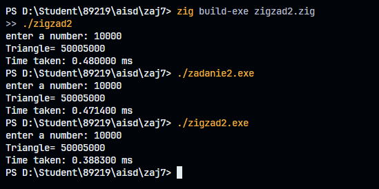

# Zajecia 7 japierdole jak mnie łeb napierdala uuaauuaa
## co to jest rekurencja???
Rekurencja to przywoływanie samej siebie 

### Prosty Przykład:
```cpp
void odliczanie(int n) {
    if (n <= 0) {  // warunek końcowy
        cout << "Start!";
        return;
    }
    cout << n << "... ";
    odliczanie(n-1);  // funkcja wywołuje samą siebie
}
```

## Kiedy używamy rekurencji? 🎯
0. nigdy elo pierdolone gówno 

1. Gdy problem można podzielić na atomy lub na mniejsze, podobne problemy
2. Gdy rozwiązanie ma naturalną strukturę rekurencyjną (nigdy )

## Przykład: Anagramy 📝

Anagramy to przestawione litery słowa. Rekurencja świetnie się do tego nadaje!

```cpp
void znajdzAnagramy(string slowo, int poczatek, int koniec) {
    if (poczatek == koniec) {
        cout << slowo << endl;  // znaleźliśmy jeden anagram
        return;
    }
    
    for (int i = poczatek; i <= koniec; i++) {
        swap(slowo[poczatek], slowo[i]);  // zamieniamy litery
        znajdzAnagramy(slowo, poczatek + 1, koniec);  // rekurencja!
        swap(slowo[poczatek], slowo[i]);  // przywracamy
    }
}
```

## Rekurencyjne Sortowanie Binarne (QuickSort) 🔄

Wyobraź sobie, że porządkujesz karty:
1. Wybierasz jedną kartę (pivot)
2. Dzielisz  pozostałe na dwie grupy: mniejsze i większe
3. Powtarzasz to dla każdej grupy

```cpp
void quickSort(int arr[], int lewy, int prawy) {
    if (lewy < prawy) {
        int pivot = podziel(arr, lewy, prawy);
        
        quickSort(arr, lewy, pivot - 1);    // sortuje od lewa
        quickSort(arr, pivot + 1, prawy);   // sortuje od prawa
    }
}
```

## Ważne Zasady! ⚠️

1. Zawsze We need to put on this thing **warunku końcowego** (base case)
2. Każde wywołanie rekurencyjne powinno przybliżać nas do warunku końcowego, gorzej gdyby było inaczej ale generalnie problem jest taki ze czasem mozna sieknąc zły znak -/+ i bedzie źle 
3. Uważaj na głębokość rekurencji(lepiej unikać dna bo możesz spotkać dolate) - może wyczerpać pamięć stosu/*stack*!

## Zalety i Wady 📊

### Zalety ✅
- Czytelny kod
- Naturalne rozwiązanie dla niektórych problemów
- Eleganckie rozwiązania

### Wady ❌
- Może zużywać dużo pamięci/ napewno tak bedzie 
- Czasami wolniejsza niż rozwiązania iteracyjne
- Może być trudna do zrozumienia na początku


# EJ EJ EJ trojkąty z twoją starą
ruchanie seks
[inicjownaie zigowania](zaj7/zigzad2.zig)




# zadanie 4 
[zadanie4 link](zadanie4.cpp)


## zadanie 4 exaplintg merge.cpp/ zadanie4.cpp 

Ten program w C++ pokazuje, jak połączyć (scalić) dwie ***posortowane*** tablice (listy liczb) w jedną, nową, również posortowaną tablicę. Wyobraź sobie, że masz dwa stosy kart posortowane według numerów (od najmniejszego do największego). Ten kod bierze te dwa stosy i tworzy trzeci, łącząc karty z obu stosów tak, aby ten nowy stos też był idealnie posortowany.

### Jak to działa (krok po kroku):

1.  **`main` (Główny Dyrygent):**
    *   Najpierw tworzymy dwie tablice z liczbami: `arrayA` i `arrayB`. **Ważne:** Te tablice *już są* posortowane rosnąco (od najmniejszej do największej liczby). To kluczowe dla działania tej metody.
    *   Tworzymy trzecią, pustą tablicę `arrayC`, która jest wystarczająco duża, aby pomieścić wszystkie liczby z `arrayA` i `arrayB` razem (tutaj 4 + 6 = 10 miejsc).
    *   Wywołujemy funkcję `merge`, dając jej obie tablice (`arrayA`, `arrayB`), informacje o ich rozmiarach (4 i 6) oraz pustą tablicę `arrayC`. To właśnie funkcja `merge` wykona całą pracę łączenia.
    *   Na koniec wywołujemy funkcję `display`, aby pokazała nam na ekranie, co znajduje się w tablicy `arrayC` po połączeniu.

2.  **`merge` (Magik Łączenia):**
    *   Ta funkcja dostaje dwie posortowane tablice (`arrayA`, `arrayB`) i pustą tablicę wynikową (`arrayC`).
    *   Używa trzech "palców wskazujących" (zmiennych `aDex`, `bDex`, `cDex`), które na początku wskazują na sam początek każdej z tablic (indeks 0).
    *   **Główna Pętla:** Dopóki w *obu* tablicach (`arrayA` i `arrayB`) są jeszcze jakieś liczby do sprawdzenia:
        *   Porównuje liczbę, na którą wskazuje palec w `arrayA` (`arrayA[aDex]`) z liczbą, na którą wskazuje palec w `arrayB` (`arrayB[bDex]`).
        *   Jeśli liczba z `arrayA` jest mniejsza, kopiuje tę mniejszą liczbę do `arrayC` (tam, gdzie wskazuje palec `cDex`). Następnie przesuwa palec w `arrayA` (`aDex++`) i palec w `arrayC` (`cDex++`) na następne pozycje.
        *   W przeciwnym razie (jeśli liczba z `arrayB` jest mniejsza lub równa), kopiuje liczbę z `arrayB` do `arrayC` i przesuwa palce `bDex++` i `cDex++`.
    *   **Sprzątanie Resztek:** Po zakończeniu głównej pętli jedna z tablic (`arrayA` lub `arrayB`) mogła zostać opróżniona, ale w drugiej mogły zostać jeszcze jakieś liczby (bo były większe od wszystkich w tej pierwszej).
        *   Dlatego są dwie dodatkowe, krótkie pętle `while`:
            *   Jeśli zostały liczby w `arrayA`, kopiuje je wszystkie po kolei do `arrayC`.
            *   Jeśli zostały liczby w `arrayB`, kopiuje je wszystkie po kolei do `arrayC`.
    *   Teraz `arrayC` zawiera wszystkie liczby z `arrayA` i `arrayB`, idealnie posortowane.

3.  **`display` (Pokazywacz):**
    *   To prosta funkcja, która bierze dowolną tablicę i jej rozmiar.
    *   Przechodzi przez całą tablicę, element po elemencie.
    *   Wypisuje każdy element na ekranie, oddzielając je spacją.
    *   Na końcu przechodzi do nowej linii, żeby wynik był czytelny.

# zadanie 5
[zadanie5_rekurencyjnescalanie](przyklad5.cpp)
Ten program demonstruje **Sortowanie przez Scalanie (Merge Sort)** w wersji **rekurencyjnej**. Jest to popularny i bardzo wydajny algorytm sortowania, działający na zasadzie "Dziel i Zwyciężaj" (Divide and Conquer).

Wyobraź sobie, że masz talię pomieszanych kart i chcesz je posortować od najmniejszej do największej. Merge Sort działa mniej więcej tak:

1.  **Dziel:** Jeśli masz więcej niż jedną kartę, podziel talię na dwie równe (lub prawie równe) połówki.
2.  **Zwyciężaj (Rekurencyjnie):** Zrób to samo (podziel na pół) dla każdej z tych połówek. Powtarzaj ten proces, aż dojdziesz do sytuacji, gdzie masz same pojedyncze karty. Pojedyncza karta jest z definicji "posortowana".
3.  **Scalaj:** Teraz zacznij łączyć te pojedyncze karty z powrotem w większe, **posortowane** stosy. Bierzesz dwa małe posortowane stosiki i łączysz je w jeden większy, również posortowany stos (tak jak w poprzednim przykładzie `merge`). Powtarzasz to łączenie, aż wszystkie karty wrócą do jednego, dużego, idealnie posortowanego stosu.

### Struktura Kodu

Kod wykorzystuje klasę `DArray`, aby zgrupować dane (listę liczb) i operacje na nich (wstawianie, wyświetlanie, sortowanie) w jednym miejscu.

1.  **Klasa `DArray`:**
    *   **`private`:**
        *   `vector<double> theVect;`: Dynamiczna tablica (wektor) przechowująca liczby `double`. Jest "dynamiczna", bo może zmieniać rozmiar w razie potrzeby.
        *   `int nElems;`: Zmienna przechowująca informację, ile liczb *faktycznie* wstawiliśmy do wektora.
        *   `recMergeSort(...)`: **Prywatna funkcja rekurencyjna.** To jest serce algorytmu. Dzieli problem na mniejsze i wywołuje samą siebie dla tych mniejszych problemów.
        *   `merge(...)`: **Prywatna funkcja scalająca.** Działa bardzo podobnie do funkcji `merge` z poprzedniego przykładu – bierze dwie *już posortowane* części wektora i łączy je w jedną posortowaną całość, używając do tego tymczasowej tablicy roboczej (`workSpace`).
    *   **`public`:**
        *   `DArray(int max)`: **Konstruktor.** Wywoływany przy tworzeniu obiektu `DArray`. Inicjalizuje licznik `nElems` na 0 i rezerwuje wstępnie miejsce w wektorze `theVect`.
        *   `insert(double value)`: Dodaje nową liczbę na koniec listy w `theVect` i zwiększa licznik `nElems`.
        *   `display()`: Wyświetla aktualną zawartość `theVect` (tylko wstawione elementy).
        *   `mergeSort()`: **Publiczna funkcja rozpoczynająca sortowanie.** To ją wywołujemy z zewnątrz (z `main`). Tworzy ona potrzebną tablicę roboczą (`workSpace`) i uruchamia pierwszy raz rekurencyjną funkcję `recMergeSort` dla całej listy liczb.

2.  **Funkcja `main()`:**
    *   Tworzy obiekt `arr` klasy `DArray`.
    *   Wstawia do niego kilkanaście nieposortowanych liczb za pomocą `arr.insert()`.
    *   Wyświetla stan początkowy za pomocą `arr.display()`.
    *   Wywołuje sortowanie: `arr.mergeSort()`. To uruchamia cały proces rekurencyjnego dzielenia i scalania.
    *   Wyświetla stan końcowy (posortowany) za pomocą `arr.display()`.

### Kluczowe Funkcje Wyjaśnione Prościej

*   **`mergeSort()` (Publiczny Start)**
    *   "Hej, `recMergeSort`, zaczynamy! Masz tu całą listę od indeksu 0 do ostatniego (`nElems-1`) i tymczasową tablicę `workSpace` do pomocy."

    ```cpp
    void mergeSort()
    {
        vector<double> workSpace(nElems); // Przygotuj miejsce na tymczasowe notatki
        recMergeSort(workSpace, 0, nElems-1); // Zacznij sortować wszystko
    }
    ```

*   **`recMergeSort()` (Rekurencyjny Mózg - Dziel i Zwyciężaj)**
    *   "Dostałem zadanie posortowania fragmentu listy od `lowerBound` do `upperBound`."
    *   "Czy ten fragment ma tylko jeden element (`lowerBound == upperBound`)?"
        *   "Tak? Super, nic nie muszę robić, jest już posortowany. Wracam." **(Warunek bazowy)**
    *   "Nie? OK, do roboty:"
        *   "Znajduję środek `mid`."
        *   "**Deleguję zadanie:** Wywołuję *siebie samego* (`recMergeSort`), żeby ktoś inny (lub ja w przyszłości) posortował lewą połówkę (od `lowerBound` do `mid`)."
        *   "**Deleguję zadanie:** Wywołuję *siebie samego* (`recMergeSort`), żeby ktoś inny posortował prawą połówkę (od `mid+1` do `upperBound`)."
        *   "Czekam, aż obie połówki wrócą posortowane."
        *   "Teraz mam dwie posortowane połówki. Wołam funkcję `merge`, żeby je połączyła w jedną całość." **(Scalanie)**

    ```cpp
    void DArray::recMergeSort(vector<double>& workSpace, int lowerBound, int upperBound)
    {
        if(lowerBound == upperBound) // Mam tylko 1 element?
            return;                 // To już posortowane!
        else
        {
            int mid = (lowerBound+upperBound) / 2; // Znajdź środek
            recMergeSort(workSpace, lowerBound, mid);      // Posortuj lewą połowę (rekurencyjnie)
            recMergeSort(workSpace, mid+1, upperBound);    // Posortuj prawą połowę (rekurencyjnie)
            merge(workSpace, lowerBound, mid+1, upperBound); // Scal posortowane połówki
        }
    }
    ```

*   **`merge()` (Pracowity Scalacz)**
    *   "Dostałem dwie posortowane części listy (`theVect`) i tablicę roboczą (`workSpace`). Moim zadaniem jest je połączyć."
    *   "Ustawiam wskaźniki na początek obu części (`lowPtr`, `highPtr`) i na początek `workSpace` (`j`)."
    *   "Dopóki mam elementy w *obu* częściach:"
        *   "Porównuję element wskazywany przez `lowPtr` z elementem wskazywanym przez `highPtr`."
        *   "Mniejszy z nich kopiuję do `workSpace` na pozycję `j`."
        *   "Przesuwam wskaźnik tej części, z której skopiowałem, oraz wskaźnik `j`."
    *   "Gdy jedna część się skończy, kopiuję wszystkie pozostałe elementy z drugiej części do `workSpace`."
    *   "Teraz w `workSpace` mam cały połączony i posortowany fragment."
    *   "**Bardzo ważne:** Kopiuję ten posortowany fragment z `workSpace` z powrotem do oryginalnej listy `theVect`, na właściwe miejsce (od `lowerBound`). Bez tego kroku sortowanie by nie zadziałało!"

    ```cpp
    // (Fragment - kluczowe kroki)
    while(lowPtr <= mid && highPtr <= upperBound) // Dopóki są elementy w obu połówkach
    {
        if( theVect[lowPtr] < theVect[highPtr] ) // Porównaj
            workSpace[j++] = theVect[lowPtr++]; // Kopiuj mniejszy do workSpace
        else
            workSpace[j++] = theVect[highPtr++];
    }
    // ... kopiowanie resztek ...
    for(j=0; j<n; j++) // Skopiuj z workSpace z powrotem do theVect
        theVect[lowerBound+j] = workSpace[j];
    ```


